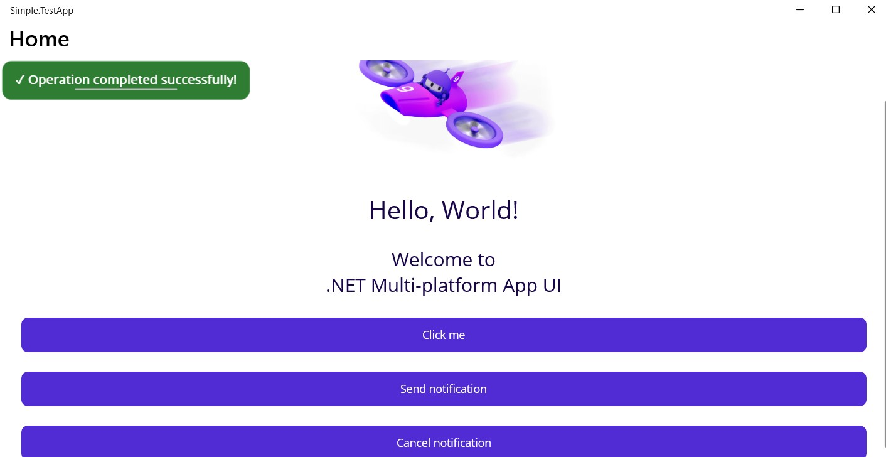
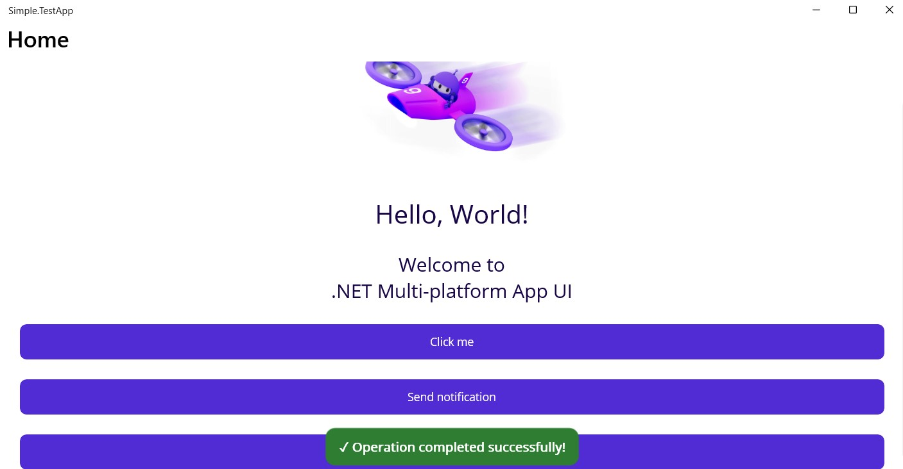
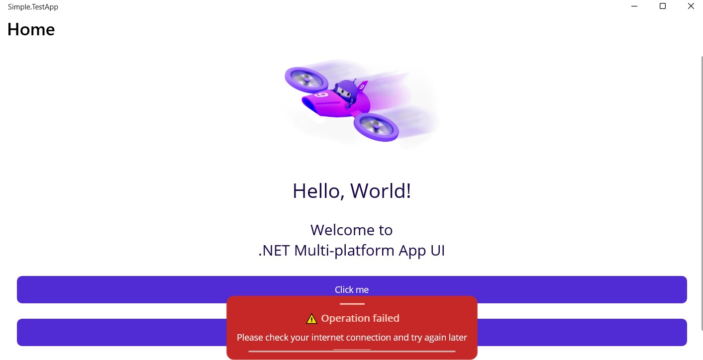

# Table of contents
 
1. [Quick start](#quick-start)
1. [Features and limitations](#features-and-limitations)
1. [Examples](#examples)

# Quick start
1. Download package [](https://www.nuget.org/packages/Simple.Toast)
1. Register `simple` xml namespace in page:
```xaml
<ContentPage xmlns="http://schemas.microsoft.com/dotnet/2021/maui"
             xmlns:x="http://schemas.microsoft.com/winfx/2009/xaml"
             ...
             xmlns:simple="clr-namespace:Simple.Toast;assembly=Simple.Toast"> <!-- Add namespace -->
```

1. Add toast component to top-level page container:
```xaml
    <Grid RowDefinitions="*"
          ColumnDefinitions="*">
                    <!--DismissDelay: toast dismiss delay, milliseconds
                    Show: boolean property, showing toast when true
                    Dismiss: boolean property, closing toast when true
                    ToastDirection: enum property, switches toast appearance direction
                    Important: set ZIndex property value-->
        <simple:Toast DismissDelay="2000" 
                      ToastBackgroundColor="#2E7D32" 
                      CornerRadius="12"
                      ToastPadding="16,12"
                      ProgressBarColor="#81C784"
                      Show="{Binding Show}" 
                      Dismiss="{Binding Dismiss}"
                      ToastDirection="LeftToRight"
                      VerticalOptions="Start"
                      HorizontalOptions="Center"
                      ZIndex="5">
            <simple:Toast.InnerContent> <!--Toast inner content-->
                <Label Text="✓ Operation completed successfully!"
                       TextColor="White"
                       FontSize="16"
                       FontAttributes="Bold"
                       HorizontalTextAlignment="Center"
                       VerticalTextAlignment="Center" />
            </simple:Toast.InnerContent>
        </simple:Toast>
    <!-- ... -->
    </Grid>
```

1. Add observable properties and bind them to `Show` and `Dismiss` toast properties:
```csharp
public partial class MainPageVM : ObservableObject
{  
    [ObservableProperty]
    private bool _show = false;

    [ObservableProperty]
    private bool _dismiss = false;

    //...
}
```

1. Show configured toast or dismiss it in viewmodel:
```csharp
public partial class MainPageVM : ObservableObject
{  
    //...observable properties definitions...
   
    [RelayCommand]
    public void ShowNotification()
    {
        Show = true;
    }

    [RelayCommand]
    public void CancelNotification()
    {
        Dismiss = true;
    }

    //...
}

```

# Features and limitations

## Properties

### Show

* `Show` property **must** be bound with `TwoWay` binding mode. This behavior is enabled by default. Any other binding modes would cause bugs. Consider not changing `Show` binding mode.
* `Show` property automatically resets to `false` value when changed to `true`. Thus, one may use `Show = true` to show toast multiple times.
* Setting `Show = true` multiple times resets running toast animations.

### Dismiss
 
* `Dismiss` property is similar to `Show`: setting `Dismiss = true` hides toast; it automatically resets to `false` when set to `true`; one may use `Dismiss = true` multiple times.

### ToastDirection

`ToastDirection` property supports 4 toast appearance directions:
* TopToDown
* LeftToRight
* DownToTop
* RightToLeft

**Important side-effect** of setting `ToastDirection` value is that when `TopToDown` and `DownToTop` values are set, `VerticalOptions` property **is ignored**, as well as `LeftToRight` or `RightToLeft` cause `HorizontalOptions` value to be ignored.

### IsProgressBarEnabled

Enables or disables toast dismiss progress bar.

### DismissDelay

Toast dismiss delay in milliseconds.

# Examples

<figure>
  
  <figcaption>Default toast</figcaption>
</figure>

```xaml
<simple:Toast DismissDelay="2000" 
              ToastBackgroundColor="#2E7D32" 
              CornerRadius="12"
              ToastPadding="16,12"
              ProgressBarColor="#81C784"
              Show="{Binding Show}" 
              Dismiss="{Binding Dismiss}"
              ToastDirection="LeftToRight"
              VerticalOptions="Start"
              HorizontalOptions="Center"
              ZIndex="5">
    <simple:Toast.InnerContent> <!--Toast inner content-->
        <Label Text="✓ Operation completed successfully!"
                TextColor="White"
                FontSize="16"
                FontAttributes="Bold"
                HorizontalTextAlignment="Center"
                VerticalTextAlignment="Center" />
    </simple:Toast.InnerContent>
</simple:Toast>
```

<figure>
  
  <figcaption>Progress bar hidden</figcaption>
</figure>

```xaml
<simple:Toast DismissDelay="15000" 
              ToastBackgroundColor="#2E7D32" 
              CornerRadius="12"
              ToastPadding="16,12"
              ProgressBarColor="#81C784"
              Show="{Binding Show}" 
              Dismiss="{Binding Dismiss}"
              ToastDirection="DownToTop"
              VerticalOptions="Start"
              HorizontalOptions="Center"
              IsProgressBarEnabled="False"
              ZIndex="5">
    <simple:Toast.InnerContent> <!--Toast inner content-->
        <Label Text="✓ Operation completed successfully!"
               TextColor="White"
               FontSize="16"
               FontAttributes="Bold"
               HorizontalTextAlignment="Center"
               VerticalTextAlignment="Center" />
    </simple:Toast.InnerContent>
</simple:Toast>
```

<figure>
  
  <figcaption>Complex toast design</figcaption>
</figure>

```xaml
<simple:Toast DismissDelay="8000" 
              ToastBackgroundColor="#C62828" 
              CornerRadius="12"
              ToastPadding="16,12"
              ProgressBarColor="#FFAB91"
              Show="{Binding Show}" 
              Dismiss="{Binding Dismiss}"
              ToastDirection="DownToTop"
              VerticalOptions="Start"
              HorizontalOptions="Center"
              IsProgressBarEnabled="True"
              ZIndex="5">
    <simple:Toast.InnerContent>
        <StackLayout Spacing="10">
            <BoxView BackgroundColor="#FFCCBC" 
                     HeightRequest="2" 
                     WidthRequest="40" 
                     HorizontalOptions="Center" />
            <Label Text="⚠️ Operation failed"
                   TextColor="#FFCCBC"
                   FontSize="16"
                   FontAttributes="Bold"
                   HorizontalTextAlignment="Center"
                   VerticalTextAlignment="Center" />
            <Label Text="Please check your internet connection and try again later"
                   TextColor="White"
                   FontSize="14"
                   HorizontalTextAlignment="Center"
                   LineBreakMode="WordWrap" />
            <BoxView BackgroundColor="#FFCCBC" 
                     HeightRequest="1" 
                     WidthRequest="60" 
                     HorizontalOptions="Center" />
        </StackLayout>
    </simple:Toast.InnerContent>
</simple:Toast>
```